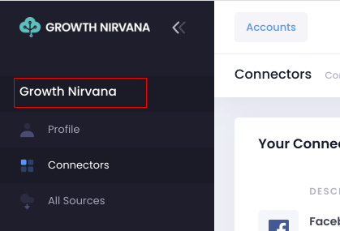
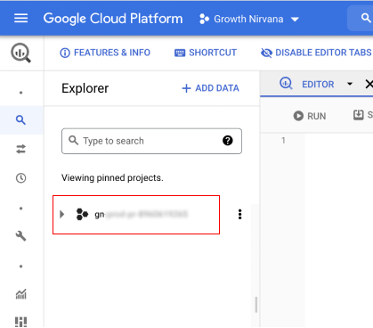
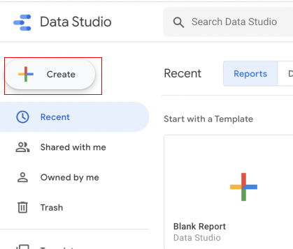
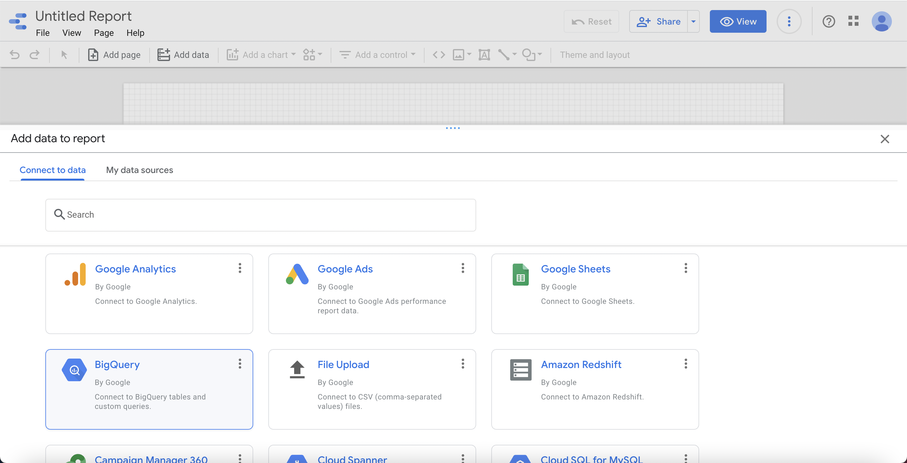
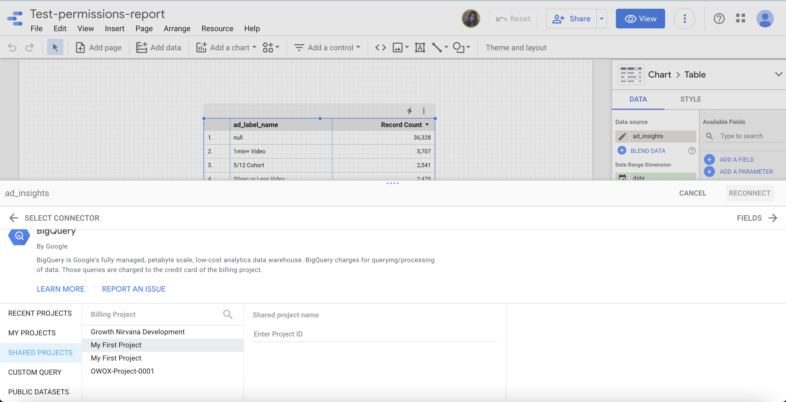
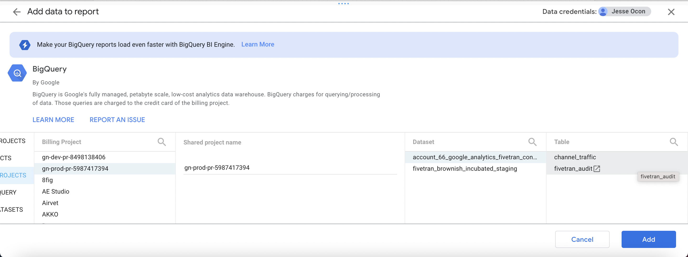

## Connecting Growth Nirvana to Google Data Studio

### In The Growth Nirvana UI

In your growth nirvana UI go to any logged in page and click on the text of your logo in the left sidebar

This will open up Google Cloud Platform with the project in the left hand sidebar of the GCP interface 

Copy the project number and save for later

### In the Google Data Studio UI

Go to <a href="https://datastudio.google.com/" target="_blank">Google Data Studio</a>,
then click on the create button in the top left corner

You will be prompted to add data to the report. In the Google connectors section choose BigQuery

Click on Shared Projects and set the billing project to one of your projects in the list

Once you choose a Billing Project the Shared Project Name will appear. Paste the project number that you copied earlier.

Now you should see all the datasets that you have access to in the list. Select one and then choose a table to add to the report. Click the add button 

Congratulations you have connected Google Data Studio with your Growth Nirvana data. 
